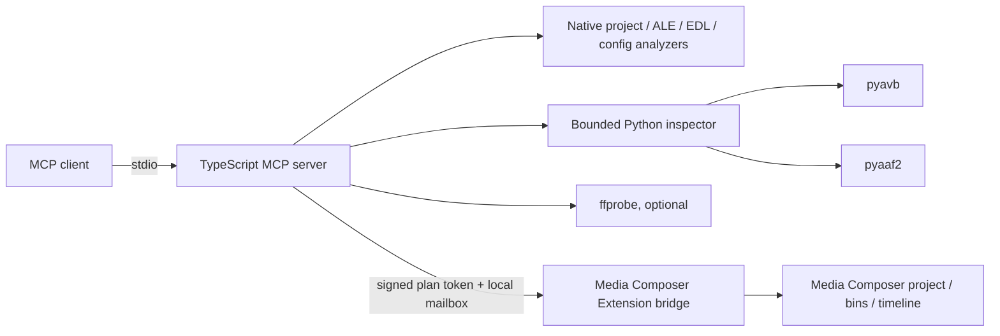

# Avid Media Composer MCP

A source-safe Model Context Protocol server for inspecting Avid Media Composer projects and, once an Avid Extension bridge is installed, applying guarded edits.

The current `0.2.0` foundation provides working offline analysis for project trees, `.avb` bins, `.aaf`, `.ale`, `.edl`, `.avp`/`.avs` configuration evidence, and media clips. It supports the current `2025.12.x`, previous `2025.6`, and long-term-maintenance `2024.12.x` Media Composer release tracks on their qualified Windows and macOS versions. It also defines a 167-action editing catalog and a tested bridge protocol. It does **not** claim live Media Composer editing until a compatible extension is connected and advertises each supported operation.

> Avid, Media Composer, MediaCentral, and related marks belong to Avid Technology, Inc. This independent project is not affiliated with or endorsed by Avid.

## What works now

- Recursively inventory and classify project, bin, setting, lock, interchange, sidecar, document, and media files.
- Detect active or orphaned `.lck` bin locks.
- Analyze AVB object graphs, bin views, mobs, tracks, clips, sequences, and metadata through `pyavb`.
- Analyze AAF mobs, slots, components, essence, descriptors, definitions, and metadata through `pyaaf2`.
- Parse every ALE heading, column, and row.
- Parse CMX-style EDL events, transitions, comments, clip names, and motion-effect lines.
- Decode text-like AVP/AVS/configuration files; fingerprint, measure, and string-extract opaque binary files without pretending their semantics are known.
- Inspect container and stream metadata through `ffprobe`, with optional frame/packet counting and SHA-256 hashing.
- Preview compound editing plans, classify risk, require destructive opt-in, and bind approval to an exact SHA-256 confirmation token.
- Report enabled authority, dependency health, source coverage, truncation, provider gates, and live bridge status.
- Evaluate Media Composer/Windows/macOS/architecture combinations against source-linked Avid rules.
- Detect standard Media Composer application locations on Windows and macOS.

## What still requires Avid access

True in-editor control depends on the **Media Composer Extensions SDK** (formerly Panel SDK) and a bridge extension running inside Media Composer. Avid describes the SDK as the integration path for project, bin, and timeline tools, but its current onboarding page says new partners are not actively being onboarded.

Until that bridge exists:

- `avid_get_live_state` fails closed with `BRIDGE_NOT_CONNECTED`.
- `avid_apply_edit_plan` fails closed even when the `edit` capability is enabled.
- An action appearing in the catalog is a planned contract, not evidence that Media Composer performed it.

See [RESEARCH.md](RESEARCH.md), [supported versions](docs/SUPPORTED_VERSIONS.md), [the capability matrix](docs/CAPABILITY_MATRIX.md), and [the bridge contract](docs/AVID_EXTENSION_BRIDGE.md).

## Architecture



The analysis and live-control lanes are independent. Offline inspection remains useful if the Avid bridge is unavailable, while live control cannot silently fall back to UI automation or raw scripts.

## Quick start

Requirements:

- Node.js 20 or newer
- Python 3.9 or newer for AVB/AAF analysis
- `ffprobe` on `PATH` for clip analysis
- Media Composer 2025.12.x, 2025.6, or 2024.12.x plus a protocol v2 Extension bridge for live control

```powershell
git clone https://github.com/leancoderkavy/avid-media-composer-mcp.git
cd avid-media-composer-mcp
npm install
python -m venv .venv
.\.venv\Scripts\python.exe -m pip install -r .\python\requirements.txt
$env:AVID_MCP_ALLOWED_ROOTS = "C:\Users\you\Documents\Avid Projects"
npm run build
```

Run the local stdio server:

```powershell
node .\dist\index.js
```

Example MCP client configuration:

```json
{
  "mcpServers": {
    "avid-media-composer": {
      "command": "node",
      "args": ["C:\\path\\to\\avid-media-composer-mcp\\dist\\index.js"],
      "env": {
        "AVID_MCP_ALLOWED_ROOTS": "C:\\Users\\you\\Documents\\Avid Projects",
        "AVID_MCP_CAPABILITIES": "inspect"
      }
    }
  }
}
```

Keep `AVID_MCP_CAPABILITIES=inspect` until a bridge has been installed and tested. To enable confirmed live edits later:

```powershell
$env:AVID_MCP_CAPABILITIES = "inspect,edit"
$env:AVID_MCP_BRIDGE_DIR = "$env:LOCALAPPDATA\avid-media-composer-mcp\bridge"
```

## Tools

| Tool | Purpose | Mutation |
| --- | --- | --- |
| `avid_ping` | Server health and mode | None |
| `avid_get_capabilities` | Authority, dependency, coverage, and bridge report | None |
| `avid_get_bridge_status` | Validate bridge heartbeat and advertised support | None |
| `avid_get_compatibility_matrix` | Report the latest three release/platform contracts | None |
| `avid_check_compatibility` | Evaluate a Media Composer/OS/architecture combination | None |
| `avid_detect_installations` | Find standard Windows/macOS installations | None |
| `avid_get_edit_operation_catalog` | Browse the 167 planned editing actions | None |
| `avid_discover_projects` | Find directories containing `.avp` files | None |
| `avid_inventory_project_files` | Classify and optionally hash a project tree | None |
| `avid_analyze_project` | Aggregate project/config/bin/interchange/media report | None |
| `avid_analyze_bin` | Deep `.avb` analysis through `pyavb` | None |
| `avid_analyze_aaf` | Deep `.aaf` analysis through `pyaaf2` | None |
| `avid_analyze_ale` | Parse ALE headings, columns, and rows | None |
| `avid_analyze_edl` | Parse CMX-style EDL data | None |
| `avid_analyze_configuration` | Decode or fingerprint AVP/AVS/configuration files | None |
| `avid_analyze_clip` | Full `ffprobe` metadata and editorial summary | None |
| `avid_get_live_state` | Read live state through an Extension bridge | Bridge request only |
| `avid_preview_edit_plan` | Validate, risk-label, and tokenize a plan | None |
| `avid_apply_edit_plan` | Apply an exact confirmed plan through the bridge | Yes |

The server also exposes:

- resource `avid://catalog/edit-actions`
- prompt `avid-project-audit`
- prompt `avid-safe-edit`

## Project analysis example

Ask your MCP client:

> Use `avid_analyze_project` on `D:\Avid Projects\Episode_101`. Include hashes, configurations, bins, and AAF. Do not analyze media payloads yet. Separate parsed evidence, opaque files, lock risks, and unavailable dependencies.

Large projects are bounded by explicit limits:

- `AVID_MCP_MAX_FILES` (default `10000`)
- `AVID_MCP_MAX_BINS` (default `100`)
- `AVID_MCP_MAX_MEDIA_FILES` (default `100`)
- `AVID_MCP_COMMAND_TIMEOUT_MS` (default `30000`)

Reports always identify truncation and per-format analyzed/unavailable/failed counts.

## Safe edit workflow

1. Call `avid_get_bridge_status`.
2. Call `avid_get_live_state`.
3. Build a plan from actions the bridge lists in `supportedEditOperations`.
4. Include `expectedState` guards for project, sequence, bin, clip, or track identifiers.
5. Call `avid_preview_edit_plan`.
6. Review destructive/external actions and blockers.
7. Pass the unchanged plan and exact returned token to `avid_apply_edit_plan`.
8. Re-inspect the affected live state.

Example plan:

```json
{
  "projectId": "project-uuid",
  "allowDestructive": false,
  "operations": [
    {
      "action": "bin.create",
      "arguments": { "name": "Selects" },
      "expectedState": { "projectId": "project-uuid" }
    }
  ]
}
```

## Development

```powershell
npm run typecheck
npm test
npm run test:python
npm run build
npm run smoke
npm run pack:dry-run
```

Or run every release gate:

```powershell
npm run check
```

The test suite covers native parsers, binary configuration handling, allowed-root enforcement, project/lock analysis, stable edit tokens, simulated bridge application, MCP discovery/annotations/resources/prompts, and read-only AVB/AAF fixtures.

## Important format boundary

AVB, AVP, and AVS are not public, Avid-supported interchange specifications. `pyavb` can read and write many AVB structures, but independent reverse-engineered coverage is not equivalent to guaranteed compatibility with every Media Composer release or object type. This server therefore:

- opens AVB/AAF read-only for analysis;
- never writes an open or locked bin offline;
- preserves unrecognized or opaque evidence in reports;
- uses AAF/ALE/EDL and the Extensions SDK as the preferred supported exchange/control surfaces.

## License

MIT. Python dependencies and optional media tools retain their own licenses.
