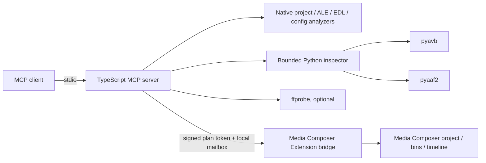

# Avid Media Composer MCP Server

Original [workflow skills](docs/WORKFLOW_SKILLS.md) are included for ingest/QC, selects, review markers, turnover and export in this development branch.

> Unreleased development: this checkout adds a separate Windows native adapter and local media/search tools. See [local setup](docs/LOCAL_SETUP.md) and [implementation status](docs/IMPLEMENTATION_STATUS.md). These changes are not yet in the public 1.1.0 package.

The development adapter now includes [guarded AAF selects import](docs/NATIVE_AAF_IMPORT.md): inspect source ranges and local media, preview an import into an empty bin, apply once, and verify native composition metadata. Save/reopen, source-graph and render evidence remain separately reported.

An independent, source-safe [Model Context Protocol (MCP)](https://modelcontextprotocol.io/) server for Avid Media Composer project analysis, bin inspection, post-production metadata, and guarded editing automation.

[Website](https://avid-media-composer-mcp.vercel.app/) · [Setup](#quick-start) · [Capabilities](docs/CAPABILITY_MATRIX.md) · [Security](SECURITY.md) · [npm](https://www.npmjs.com/package/avid-media-composer-mcp)

Use it to connect Claude, ChatGPT, Codex, or another MCP client to local Avid project evidence without modifying source media. The stable `1.1.0` release adds marker/SVG, transcript, DNx turnover, OTIO handoff, CTMS, and integration diagnostics to the 1.0 analysis foundation. It supports the current `2025.12.x`, previous `2025.6`, and long-term-maintenance `2024.12.x` Media Composer release tracks on their qualified Windows and macOS versions.

The server also defines a 167-action editing catalog and a tested bridge protocol. It does **not** claim live Media Composer editing until a compatible Avid Extension is connected and advertises each supported operation.

> Avid, Media Composer, MediaCentral, and related marks belong to Avid Technology, Inc. This independent project is not affiliated with or endorsed by Avid.

## Facts at a glance

| Question | Answer |
| --- | --- |
| What is this? | An open-source MCP server for Avid Media Composer analysis and guarded automation. |
| What can it inspect? | AVB bins, AAF files, ALE logs, EDLs, OTIO JSON, AVP/AVS configuration evidence, project trees, locks, and media metadata. |
| Does it modify Avid projects offline? | No. Offline analysis is read-only and source media is never modified. |
| Can it edit a live Media Composer session? | Only through a separately installed, compatible Avid Extension bridge. Without that bridge, editing fails closed. |
| Which systems are supported? | Qualified Windows and macOS combinations for Media Composer 2025.12.x, 2025.6, and 2024.12.x. |
| Which AI clients can use it? | Any standards-compatible MCP client that can launch a local stdio server or connect to authenticated Streamable HTTP. |
| Is it an official Avid product? | No. It is an independent MIT-licensed project. |

## What works now

- Recursively inventory and classify project, bin, setting, lock, interchange, sidecar, document, and media files.
- Detect active or orphaned `.lck` bin locks.
- Analyze AVB object graphs, bin views, mobs, tracks, clips, sequences, and metadata through `pyavb`.
- Analyze AAF mobs, slots, components, essence, descriptors, definitions, and metadata through `pyaaf2`.
- Parse every ALE heading, column, and row.
- Parse CMX-style EDL events, transitions, comments, clip names, and motion-effect lines.
- Validate source-marker packages and a strict static SVG-overlay subset before import.
- Compare transcript revisions locally without returning transcript text.
- Assess supplied DNx/DNx 4.0 turnover metadata and compatibility risks without transcoding.
- Preview conservative OTIO handoffs with local-media manifests, optional checksums, and relink blockers.
- Read an explicitly configured, allowlisted MediaCentral CTMS HAL registry without mutation.
- Read OTIO JSON structurally with bounded input/depth/object limits, flagging transitions, effects, retimes, nested timelines, media references, and audio-routing risks that need Media Composer confirmation.
- Decode text-like AVP/AVS/configuration files; fingerprint, measure, and string-extract opaque binary files without pretending their semantics are known.
- Inspect container and stream metadata through `ffprobe`, with optional frame/packet counting and SHA-256 hashing.
- Preview compound editing plans, classify risk, require destructive opt-in, and bind approval to an exact SHA-256 confirmation token.
- Report enabled authority, dependency health, source coverage, truncation, provider gates, and live bridge status.
- Evaluate Media Composer/Windows/macOS/architecture combinations against source-linked Avid rules.
- Detect standard Media Composer application locations on Windows and macOS.

## Common use cases

- Ask an AI assistant to audit an Avid project before conform, turnover, migration, or archive.
- Summarize bins, sequences, tracks, clips, markers, and metadata from AVB or AAF evidence.
- Validate ALE, EDL, and OTIO interchange files and identify missing, opaque, malformed, or fidelity-sensitive data.
- Inventory project files, detect active or orphaned bin locks, and report collaboration risks.
- Inspect codec, container, duration, frame-rate, timecode, and stream metadata through `ffprobe`.
- Check whether a Media Composer version is qualified for the detected Windows or macOS environment.
- Preview a bounded edit plan and require exact confirmation before a connected extension can apply it.

## What still requires Avid access

True in-editor control depends on the **Media Composer Extensions SDK** (formerly Panel SDK) and a bridge extension running inside Media Composer. Avid describes the SDK as the integration path for project, bin, and timeline tools, but its current onboarding page says new partners are not actively being onboarded.

Until that bridge exists:

- `avid_get_live_state` fails closed with `BRIDGE_NOT_CONNECTED`.
- `avid_apply_edit_plan` fails closed even when the `edit` capability is enabled.
- An action appearing in the catalog is a planned contract, not evidence that Media Composer performed it.

See [RESEARCH.md](RESEARCH.md), [supported versions](docs/SUPPORTED_VERSIONS.md), [the capability matrix](docs/CAPABILITY_MATRIX.md), and [the bridge contract](docs/AVID_EXTENSION_BRIDGE.md).

## Architecture



The analysis and live-control lanes are independent. Offline inspection remains useful if the Avid bridge is unavailable, while live control cannot silently fall back to UI automation or raw scripts.

## Quick start

Requirements:

- Node.js 20 or newer
- Python 3.9 or newer for AVB/AAF analysis
- `ffprobe` on `PATH` for clip analysis
- Media Composer 2025.12.x, 2025.6, or 2024.12.x plus a protocol v3 Extension bridge for live control

Install and run the stable release directly:

```powershell
$env:AVID_MCP_ALLOWED_ROOTS = "C:\Users\you\Documents\Avid Projects"
$env:AVID_MCP_CAPABILITIES = "inspect"
npx -y avid-media-composer-mcp@latest
```

AVB and AAF inspection additionally needs Python plus the pinned packages in
`python/requirements.txt`. For development or those optional analyzers, install from source:

```powershell
git clone https://github.com/leancoderkavy/avid-media-composer-mcp.git
cd avid-media-composer-mcp
npm ci
python -m venv .venv
.\.venv\Scripts\python.exe -m pip install -r .\python\requirements.txt
$env:AVID_MCP_ALLOWED_ROOTS = "C:\Users\you\Documents\Avid Projects"
npm run build
```

Run the local stdio server:

```powershell
node .\dist\index.js
```

Run the authenticated Streamable HTTP transport:

```powershell
$env:MCP_AUTH_TOKEN = "<a strong random bearer token>"
npm run build
npm run start:http
```

The remote endpoint is `/mcp`; `/health` is intentionally unauthenticated for provider health
checks. Every MCP request requires `Authorization: Bearer <token>`.

Example MCP client configuration:

```json
{
  "mcpServers": {
    "avid-media-composer": {
      "command": "npx",
      "args": ["-y", "avid-media-composer-mcp@latest"],
      "env": {
        "AVID_MCP_ALLOWED_ROOTS": "C:\\Users\\you\\Documents\\Avid Projects",
        "AVID_MCP_CAPABILITIES": "inspect"
      }
    }
  }
}
```

Keep `AVID_MCP_CAPABILITIES=inspect` until a bridge has been installed and tested. To enable confirmed live edits later:

```powershell
$env:AVID_MCP_CAPABILITIES = "inspect,edit"
$env:AVID_MCP_BRIDGE_DIR = "$env:LOCALAPPDATA\avid-media-composer-mcp\bridge"
$env:AVID_MCP_BRIDGE_AUTH_SECRET = "<the same unique 32+ character secret configured in the Extension>"
```

Protocol v3 rejects unauthenticated legacy bridge documents. Keep the secret in protected local
configuration and never place it in project files, logs, or source control.

## Tools

| Tool | Purpose | Mutation |
| --- | --- | --- |
| `avid_ping` | Server health and mode | None |
| `avid_get_capabilities` | Authority, dependency, coverage, and bridge report | None |
| `avid_get_bridge_status` | Validate bridge heartbeat and advertised support | None |
| `avid_get_compatibility_matrix` | Report the latest three release/platform contracts | None |
| `avid_check_compatibility` | Evaluate a Media Composer/OS/architecture combination | None |
| `avid_detect_installations` | Find standard Windows/macOS installations | None |
| `avid_get_edit_operation_catalog` | Browse the 167 planned editing actions | None |
| `avid_discover_projects` | Find directories containing `.avp` files | None |
| `avid_inventory_project_files` | Classify and optionally hash a project tree | None |
| `avid_analyze_project` | Aggregate project/config/bin/interchange/media report | None |
| `avid_analyze_bin` | Deep `.avb` analysis through `pyavb` | None |
| `avid_analyze_aaf` | Deep `.aaf` analysis through `pyaaf2` | None |
| `avid_analyze_ale` | Parse ALE headings, columns, and rows | None |
| `avid_analyze_edl` | Parse CMX-style EDL data | None |
| `avid_analyze_otio` | Validate bounded OTIO JSON structure and report interchange-fidelity risks; does not import or relink media | None |
| `avid_preview_otio_handoff` | Build a local-media manifest, checksums, blockers, and manual-import readiness report | None |
| `avid_validate_marker_package` | Validate source markers and reject unsafe SVG overlays | None |
| `avid_compare_transcripts` | Compare transcript revisions locally and return aggregate timing/speaker QC without text | None |
| `avid_analyze_dnx_turnover` | Assess supplied DNx/DNx 4.0 turnover metadata and target-version risks | None |
| `avid_get_extension_capability_manifest` | Report SDK/onboarding/implementation/host-evidence status for all catalog actions | None |
| `avid_diagnose_integrations` | Distinguish AMA, AMT, AVX, AAX, NEXIS, and Distributed Processing prerequisites | None |
| `avid_ctms_read` | Discover or follow one allowlisted read-only MediaCentral CTMS HAL relation | Network read |
| `avid_analyze_configuration` | Decode or fingerprint AVP/AVS/configuration files | None |
| `avid_analyze_clip` | Full `ffprobe` metadata and editorial summary | None |
| `avid_get_live_state` | Read live state through an Extension bridge | Bridge request only |
| `avid_preview_edit_plan` | Validate, risk-label, and tokenize a plan | None |
| `avid_apply_edit_plan` | Apply an exact confirmed plan through the bridge | Yes |

The server also exposes:

- resource `avid://catalog/edit-actions`
- prompt `avid-project-audit`
- prompt `avid-safe-edit`

## Project analysis example

Ask your MCP client:

> Use `avid_analyze_project` on `D:\Avid Projects\Episode_101`. Include hashes, configurations, bins, and AAF. Do not analyze media payloads yet. Separate parsed evidence, opaque files, lock risks, and unavailable dependencies.

Large projects are bounded by explicit limits:

- `AVID_MCP_MAX_FILES` (default `10000`)
- `AVID_MCP_MAX_BINS` (default `100`)
- `AVID_MCP_MAX_MEDIA_FILES` (default `100`)
- `AVID_MCP_COMMAND_TIMEOUT_MS` (default `30000`)

Reports always identify truncation and per-format analyzed/unavailable/failed counts.

## Optional PostHog operations telemetry

Set `POSTHOG_API_KEY` on the server to enable privacy-safe operational telemetry. It is
disabled by default and becomes a no-op when the key is absent.

```powershell
$env:POSTHOG_API_KEY = "<PostHog project API key>"
$env:POSTHOG_HOST = "https://us.i.posthog.com"
$env:POSTHOG_DISTINCT_ID = "service:avid-media-composer-mcp"
npm run start:http
```

The server records `avid_mcp_server_started`, `avid_mcp_connection_attempt`,
`avid_mcp_request`, and `avid_mcp_tool_call` events for starts, authenticated or rejected
connection attempts, HTTP route/status/duration, and MCP tool name/outcome/duration/error
code. It does not send prompts, tool
arguments or results, paths, media or project names, bearer tokens, IP addresses, or person
profiles. Use a deployment secret for `POSTHOG_API_KEY`; never commit it.

## Safe edit workflow

1. Call `avid_get_bridge_status`.
2. Call `avid_get_live_state`.
3. Build a plan from actions the bridge lists in `supportedEditOperations`.
4. Include `expectedState` guards for project, sequence, bin, clip, or track identifiers.
5. Call `avid_preview_edit_plan`.
6. Review destructive/external actions and blockers.
7. Pass the unchanged plan and exact returned token to `avid_apply_edit_plan`.
8. Re-inspect the affected live state.

Example plan:

```json
{
  "projectId": "project-uuid",
  "allowDestructive": false,
  "operations": [
    {
      "action": "bin.create",
      "arguments": { "name": "Selects" },
      "expectedState": { "projectId": "project-uuid" }
    }
  ]
}
```

## Development

```powershell
npm run typecheck
npm test
npm run test:python
npm run build
npm run smoke
npm run smoke:package
npm run pack:dry-run
```

Or run every release gate:

```powershell
npm run check
```

Prepare or publish the npm package:

```powershell
npm run publish:npm:dry-run
npm login --auth-type=web
npm run publish:npm -- --tag=next
```

The publish path validates the distribution tag, refuses duplicate versions, and verifies both the
published version and selected npm tag. GitHub publication additionally uses provenance and the
protected `npm` environment. See the [release checklist](docs/RELEASE_CHECKLIST.md).

The hosted Fly.io service runs with `inspect` authority and `/data` as its only readable root.
It cannot see projects on an editor workstation or control Media Composer there. Local project
analysis and editing require running the MCP beside Media Composer and connecting the Extension
bridge.

The test suite covers native parsers, binary configuration handling, allowed-root enforcement, project/lock analysis, stable edit tokens, simulated bridge application, MCP discovery/annotations/resources/prompts, and read-only AVB/AAF/OTIO fixtures.

## Important format boundary

AVB, AVP, and AVS are not public, Avid-supported interchange specifications. `pyavb` can read and write many AVB structures, but independent reverse-engineered coverage is not equivalent to guaranteed compatibility with every Media Composer release or object type. This server therefore:

- opens AVB/AAF read-only for analysis;
- never writes an open or locked bin offline;
- preserves unrecognized or opaque evidence in reports;
- uses AAF/ALE/EDL/OTIO and the Extensions SDK as the preferred supported exchange/control surfaces.

## Frequently asked questions

### Is there an MCP server for Avid Media Composer?

Yes. This project provides a working MCP server for read-only Avid Media Composer project analysis. Guarded live editing is part of the protocol, but it requires a compatible Avid Extension bridge running inside Media Composer.

### Can Claude, ChatGPT, or Codex inspect an Avid project?

Yes, when the AI client supports MCP and the server is allowed to read the project directory. The client can inventory files and inspect supported AVB, AAF, ALE, EDL, OTIO, configuration, and media evidence through the tools listed above.

### Can this MCP server edit an Avid timeline?

Not by itself. The server can validate and preview editing plans, but live timeline or bin changes require the separate Extension bridge. If the bridge is absent, stale, or does not advertise an operation, the server rejects the request.

### Does the server upload footage or project data?

The local stdio server does not need to upload project data. Analysis happens beside the project, subject to explicit allowed-root controls. A remote HTTP deployment can only read files available in its own environment and should use a strong bearer token.

### Which Avid file formats are supported?

The server analyzes AVB through `pyavb`, AAF through `pyaaf2`, ALE and EDL with native parsers, AVP/AVS and related configuration files as text or bounded binary evidence, and media containers through `ffprobe`. Proprietary or opaque data is reported as such rather than guessed.

### How is this different from UI automation?

It uses structured MCP tools, bounded filesystem access, explicit capabilities, compatibility rules, and a guarded extension protocol. It does not silently fall back to mouse-and-keyboard automation or claim an edit succeeded from a preview alone.

## Project metadata

- [Capability matrix](docs/CAPABILITY_MATRIX.md)
- [Supported Media Composer versions](docs/SUPPORTED_VERSIONS.md)
- [Architecture](docs/ARCHITECTURE.md)
- [Avid Extension bridge contract](docs/AVID_EXTENSION_BRIDGE.md)
- [Research and primary sources](RESEARCH.md)
- [Security policy](SECURITY.md)
- [Contributing](CONTRIBUTING.md)
- [Support](SUPPORT.md)
- [Security audit](docs/SECURITY_AUDIT.md)
- [Citation metadata](CITATION.cff)

## License

MIT. Python dependencies and optional media tools retain their own licenses.
